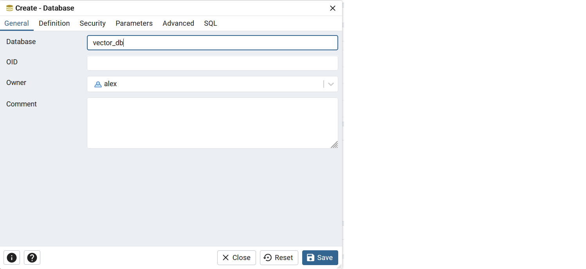
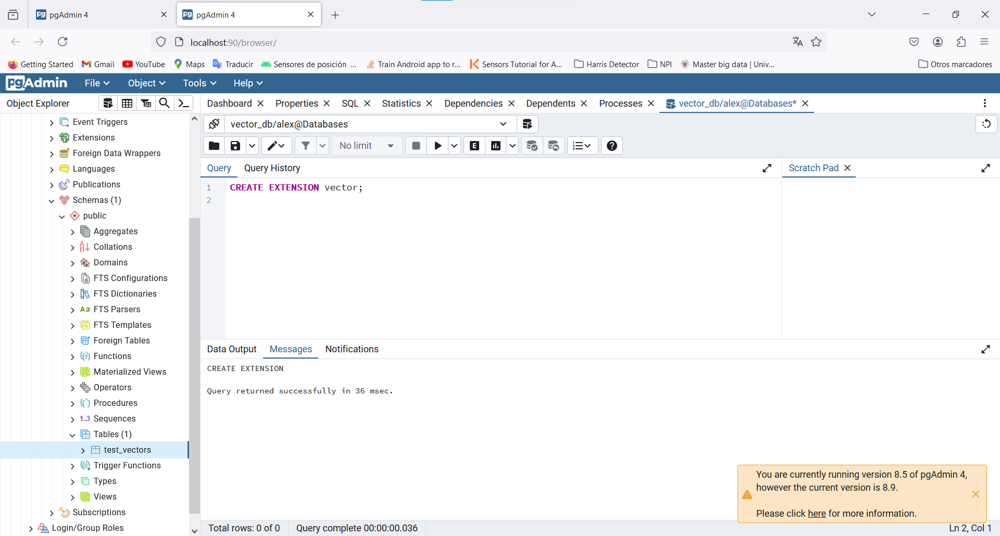

# Complete_GenIA_Platform_for_Autogen_Agents

## Architecture:

### Mlflow: Model registry
On `architecture/mlflow` you can find a docker-compose yaml to set up a multi-container architecture for an MLflow deployment, including storage, database, and web server components. Her's an explanation of each component and their roles:

Services

* Minio:
    - Image: minio/minio:RELEASE.2023-11-20T22-40-07Z
    - Role: Provides S3-compatible object storage for MLflow artifacts.
    - Ports Exposed: 9000 (API), 9001 (Console)
    - Command: Runs the Minio server with a console interface.
    - Networks: Connects to the storage network.
    - Environment Variables: Uses AWS_ACCESS_KEY_ID and - AWS_SECRET_ACCESS_KEY for root user credentials.
    - Volumes: Binds host directory /mnt/md0/minio to container’s /data directory for persistent storage.

* Create MLflow Bucket:
    - Image: minio/mc:RELEASE.2023-11-20T16-30-59Z.fips
    - Role: Initializes Minio buckets and sets policies.
    - Dependencies: Waits for Minio to be ready.
    - Networks: Connects to the storage network.
    - Environment Variables: Loads from .env file.
    - Entrypoint Script: Configures Minio client (mc), creates buckets, and sets policies.

* Postgres:
    - Build Context: ./pgvector with Dockerfile.pgvector
    - Role: Provides a PostgreSQL database for MLflow’s backend store.
    - Ports Exposed: Configurable via POSTGRES_PORT, defaults to 5432.
    - Networks: Connects to the backend network.
    - Environment Variables: Sets user, password, and database details.
    - Volumes: Persists data in db_datapg volume.

* PGAdmin:
    - Image: dpage/pgadmin4
    - Role: Provides a web interface for managing the PostgreSQL database.
    - Networks: Connects to the backend network.
    - Environment Variables: Configures default email, password, and server mode.
    - Volumes: Persists data in pgadmin volume.

* Web (MLflow Server):
    - Build Context: ./mlflow
    - Image: mlflow_server
    - Role: Runs the MLflow server.
    - Ports Exposed: 5000 (MLflow server port)
    - Networks: Connects to frontend, backend, and storage networks.
    - Environment Variables: Configures S3 endpoint and AWS credentials.
    - Command: Starts MLflow server with PostgreSQL backend and S3 artifact store.

* Nginx:
    - Build Context: ./nginx
    - Image: mlflow_nginx
    - Role: Acts as a reverse proxy for the MLflow server.
    - Ports Exposed: 80 (HTTP), 9000, 9001, 90
    - Networks: Connects to frontend, storage, and backend networks.
    - Dependencies: Waits for web and minio services to be ready.

## Networks

* frontend: Bridge network for frontend services.
* backend: Bridge network for backend services.
* storage: Bridge network for storage services.

## Volumes

* db_datapg: Volume for PostgreSQL data.
* minio: Volume for Minio data (although not explicitly used in the Minio service).
* pgadmin: Volume for PGAdmin data.

Summary

This architecture sets up a robust environment for MLflow, including:

* Minio for S3-compatible storage.
* Postgres for the backend database.
* PGAdmin for database management.
* MLflow Server for managing machine learning experiments and models.
* Nginx for reverse proxying the MLflow server.

Each service is isolated in its own container and connected via Docker networks, ensuring modularity and ease of management.

#### Steps to Connect pgAdmin to PostgreSQL:
Open pgAdmin and register a new server.
* Connection Tab:
* Host name/address: postgres_container
* Port: 5432
* Maintenance database: mlflowdb
* Username: username
* Password: password

#### Steps to add pgvector extension to a PostgreSQL container database:

1. Create a database:
    

2. Execute:
    

3. Test the created database with `testing_pgvector.py` script. This script connects to a PostgreSQL database using the psycopg2 library and registers a vector type from the pgvector extension. It establishes a connection to the database using specified credentials, creates a cursor object, and then executes a SQL query to create a table named test_vectors if it doesn't already exist. This table includes an id column as the primary key, a name column, and an embedding column to store vector data. After executing the query and committing the changes, it closes the cursor and the connection, and prints a success message. If any errors occur during this process, they are caught and printed.

### Ray Cluster: Model Serving

This setup defines a Docker Compose configuration for running a Ray cluster with a head node, integrated with Prometheus and Grafana for monitoring. The architecture includes a Dockerfile and an entrypoint script to facilitate the installation and configuration of necessary components.

#### Docker Compose Configuration (`docker-compose.yml`)

##### Version
Specifies Docker Compose file format version `3.7`.

##### Services

###### ray-head
- **Build**: Specifies the build context as `./ray`.
- **Container Name**: Named `ray-head`.
- **Ports**: Maps ports 8265 (Ray dashboard) and 3000 (Grafana) to the host.
- **Command**: Specifies the command to start the container in "head" mode.
- **Shared Memory Size**: Allocates 8GB of shared memory to the container.
- **Environment Variables**:
  - `RAY_HEAD_IP`: Sets the IP address of the Ray head node.
  - `RAY_DISABLE_DOCKER_CPU_WARNING`: Disables Docker CPU warning.
- **Volumes**: Mounts a volume `ray_data` for persistent storage at `/root/ray`.
- **Logging**: Configures logging with a maximum size of 10MB per file and a maximum of 3 files.
- **Restart Policy**: Restarts the container on failure.
- **Deploy Resources**:
  - **Limits**: Limits the container to 2 CPUs and 8GB memory.
  - **Reservations**: Reserves 1 CPU and 4GB memory for the container.

###### Volumes
- **ray_data**: Defines a local driver volume for persisting Ray data.

#### Entrypoint Script (`entrypoint.sh`)

##### Install Prometheus and Grafana
Installs Prometheus and Grafana if they are not already installed.
- Downloads and extracts Prometheus and Grafana binaries.
- Moves the extracted directories to appropriate locations (`/etc/prometheus` and `/usr/share/grafana`).

##### Environment Variable
Sets `RAY_GRAFANA_HOST` to `http://127.0.0.1:3000`.

##### Ray Start Commands
- If the script is run with the argument `head`, it starts the Ray head node with the dashboard accessible on all interfaces and metrics exported on port 8080, using 12 CPUs.
- If the script is run with the argument `worker`, it starts a Ray worker node connecting to the head node, with metrics exported on port 8080, using 12 CPUs.
- For other arguments, it executes the provided command.

##### Wait for Ray to Start
Sleeps for 20 seconds to allow Ray to initialize and generate necessary configuration files.

##### Start Prometheus and Grafana
- Starts Prometheus with the configuration file generated by Ray.
- Starts Grafana with the configuration file and provisioning directory generated by Ray.

##### Keep the Container Running
Uses `tail -f /dev/null` to keep the container running indefinitely.

#### Dockerfile

##### Base Image
Uses `python:3.10` as the base image.

##### Install Packages
- Updates package lists and installs build-essential and curl.
- Installs Ray version 2.31.0 using pip.
- Cleans up unnecessary files to reduce image size.

##### Working Directory
Sets the working directory to `/root`.

##### Copy Entrypoint Script
Copies the `entrypoint.sh` script to `/usr/local/bin/`.

##### Make Entrypoint Script Executable
Changes the script permissions to make it executable.

##### Entrypoint
Specifies `entrypoint.sh` as the entrypoint script to run when the container starts.

#### Summary

This setup creates a Ray cluster head node within a Docker container, integrated with Prometheus and Grafana for monitoring. The `entrypoint.sh` script ensures that Prometheus and Grafana are installed, and starts them along with the Ray head or worker nodes, depending on the command-line arguments. The Dockerfile prepares the environment by installing necessary packages and setting up the entrypoint script. This architecture provides a scalable and monitored environment for running distributed computing tasks with Ray.
