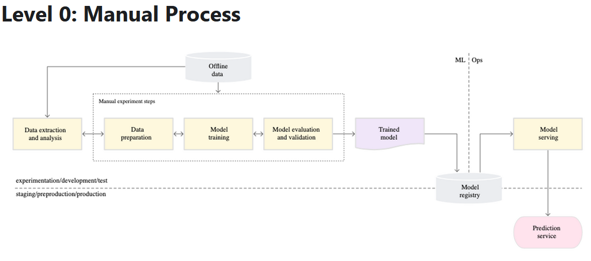
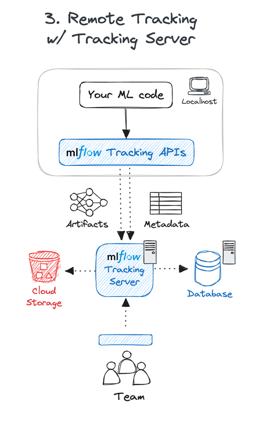
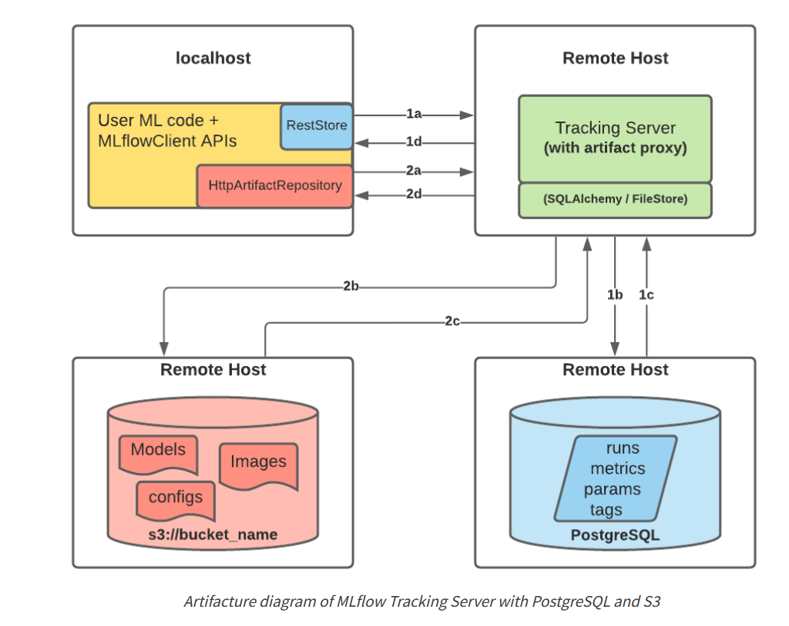
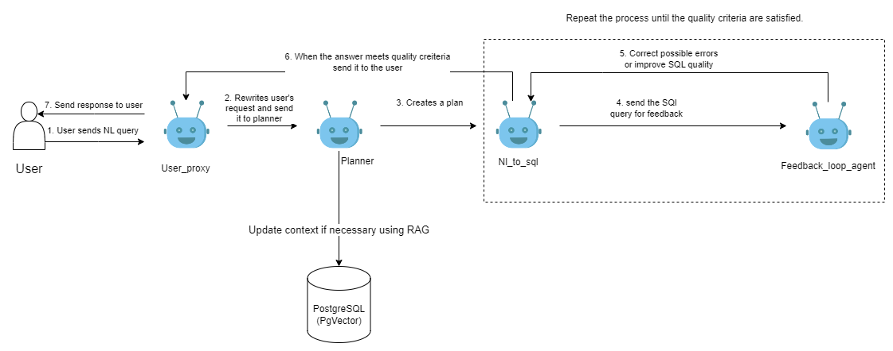
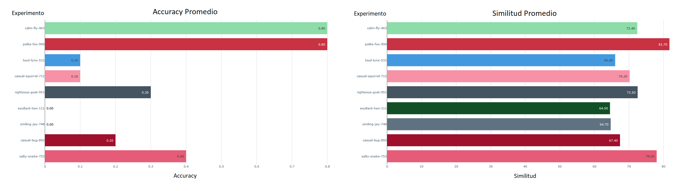
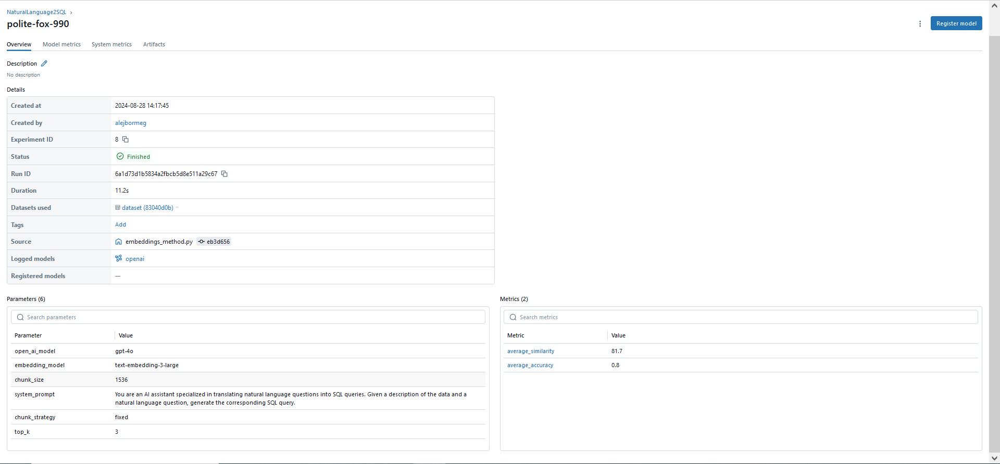
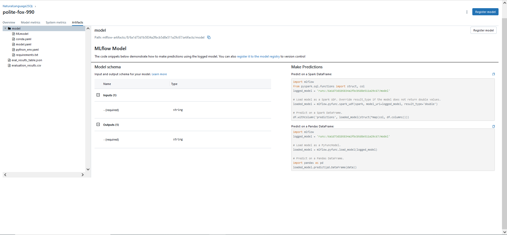
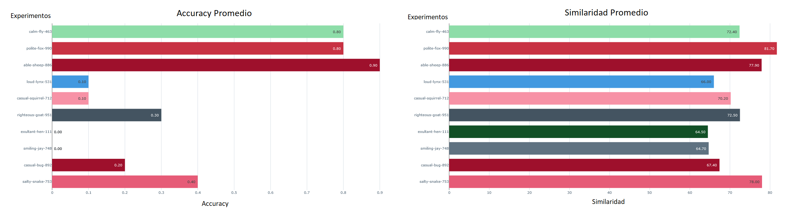

\newpage
\tableofcontents
\newpage

# Abstract
En este trabajo de fin de máster, se ha diseñado y evaluado una plataforma de inteligencia artificial (IA) para la traducción automática de lenguaje natural a SQL (NL2SQL) basada en un enfoque on-premise. Se centra en el uso de técnicas avanzadas como la generación aumentada por recuperación (RAG) y la implementación de agentes expertos autónomos. Este sistema permite la interacción eficaz en lenguaje natural para generar consultas SQL precisas, aplicando modelos avanzados de lenguaje sin reentrenamiento explícito. La arquitectura robusta y modular facilita el despliegue de soluciones de IA independientes de proveedores de servicios en la nube, optimizando tanto la gestión de bases de datos como el procesamiento de lenguaje natural en entornos empresariales y de datos. Este estudio demuestra cómo una infraestructura de IA bien integrada puede mejorar significativamente la accesibilidad y la eficiencia de las tecnologías de bases de datos en diversos escenarios de aplicación.

\newpage

## 1. Introducción

### 1.1. Contexto y Motivación

La rápida evolución de la inteligencia artificial (IA) y el surgimiento de la generación de IA han revolucionado numerosos sectores, facilitando el desarrollo de soluciones innovadoras y cada vez más sofisticadas. A lo largo del Máster en Big Data, Data Science & Inteligencia Artificial en la Universidad Complutense de Madrid, se adquirieron conocimientos avanzados en inteligencia artificial, manejo de grandes volúmenes de datos, y programación en Python. Uno de los campos más prometedores es el desarrollo de agentes autónomos que realizan tareas complejas de manera independiente. 

El progreso en modelos de lenguaje avanzados, especialmente los desarrollados por OpenAI, ha abierto nuevas vías para sistemas interactivos en lenguaje natural. A pesar de sus ventajas, un reto persistente es la integración eficaz de estos modelos sin necesidad de reentrenamiento constante, utilizando enfoques como la Generación Aumentada por Recuperación (RAG). Este trabajo de fin de máster responde a la necesidad de aplicar estos conocimientos prácticamente, mediante la creación de una plataforma de IA operativa y aplicable en un contexto productivo.

El objetivo es diseñar y desarrollar una plataforma de IA independiente de servicios en la nube, basada en contenedores y máquinas virtuales para un entorno local. Esta infraestructura facilitará el despliegue eficiente de soluciones de IA y se aplicará específicamente a la traducción de lenguaje natural a SQL (NL2SQL) mediante agentes expertos, optimizando así la precisión y eficiencia del sistema mediante la tecnología RAG.

### 1.2. Objetivos del TFM

Este trabajo de fin de máster tiene como metas:

- **Desarrollar una plataforma de IA funcional y completa:** Construir una arquitectura modular y escalable que permita el despliegue de soluciones de IA en un entorno local, independiente de proveedores de nube.
- **Implementar técnicas de Generación Aumentada por Recuperación (RAG):** Utilizar modelos avanzados de OpenAI para mejorar la gestión del conocimiento y la eficacia en la generación de respuestas sin necesidad de reentrenamiento constante.
- **Desarrollar un sistema de agentes expertos en NL2SQL:** Crear un sistema interactivo que permita a los usuarios formular consultas SQL a través de instrucciones en lenguaje natural, usando agentes autónomos que mejoren la precisión y relevancia de las respuestas.
- **Validar y probar el sistema:** Evaluar exhaustivamente el rendimiento de la plataforma para garantizar su capacidad de manejar cargas de trabajo en producción y adaptarse a distintos escenarios de uso.

### 1.3. Estructura del Documento

El documento está organizado de la siguiente manera:

- **Capítulo 2: Estado del Arte:** Explora la literatura existente y evalúa las soluciones actuales en el ámbito de los agentes inteligentes, la traducción NL2SQL y las técnicas RAG, identificando limitaciones y justificando la necesidad de la nueva plataforma.
- **Capítulo 3: Arquitectura de la Plataforma:** Describe detalladamente la arquitectura de la plataforma, incluyendo los componentes clave como el almacenamiento de artefactos, la gestión de bases de datos, el seguimiento de modelos y la orquestación de tareas.
- **Capítulo 4: Desarrollo del Sistema de Agentes NL2SQL:** Detalla el proceso de diseño e implementación del sistema de agentes, desde la selección y entrenamiento de modelos de lenguaje hasta la implementación de la infraestructura necesaria para su coordinación.
- **Capítulo 5: Pruebas y Validación:** Presenta la metodología de pruebas empleada para validar la funcionalidad y rendimiento de la plataforma, junto con los resultados obtenidos.
- **Capítulo 6: Casos de Uso y Aplicaciones:** Explora aplicaciones potenciales de la plataforma en entornos empresariales y compara su rendimiento con otras soluciones del mercado.
- **Capítulo 7: Conclusiones:** Resume los hallazgos y destaca las contribuciones del trabajo, proponiendo líneas de investigación y desarrollo futuro para expandir y mejorar la plataforma.
## 3. Arquitectura de la Plataforma
### 3.1. Visión General de la Plataforma

La plataforma desarrollada en este proyecto está diseñada para ser una solución integral y modular, capaz de gestionar y desplegar modelos de inteligencia artificial en un entorno de producción on-premise. Se trata de una arquitectura compuesta por múltiples componentes interconectados, cada uno de los cuales cumple una función específica en el ciclo de vida de los modelos de IA, desde su almacenamiento hasta su despliegue y gestión continua.

La plataforma está construida sobre tecnologías de contenedorización y virtualización, utilizando Docker y Docker Compose para orquestar los servicios de manera eficiente. La elección de un entorno on-premise permite una mayor flexibilidad e independencia respecto a proveedores de la nube, lo que facilita su adaptación a diferentes infraestructuras y requisitos de seguridad. 

Los componentes principales incluyen **Minio** para el almacenamiento de artefactos, **PostgreSQL** y **PGAdmin** para la gestión de bases de datos, **MLflow** para el registro y seguimiento de modelos, y **Ray Cluster** para la distribución y despliegue de tareas. Estos elementos están integrados en una red de Docker, que asegura el aislamiento y persistencia de datos, mientras que **Nginx** actúa como un proxy inverso para gestionar las solicitudes de manera segura y eficiente. Cada uno de estos componentes corre en un contenedor propio y para levantar la plataforma completa usamos *Docker Compose*.

El diseño de esta plataforma se ha realizado siguiendo el arículo de Google [MLOps: Continuous Delivery and Automation Pipelines in Machine Learning](https://cloud.google.com/architecture/mlops-continuous-delivery-and-automation-pipelines-in-machine-learning?hl=es-419). En el cual se presenta la siguiente arquitectura para el Stage 0 de un sistema de Machine Learning:



Este primer stage se caracteriza por la presencia aún de fases manuales para el tratamiento de datos, experimentación y selección de modelo ganador, pero incluye la presencia de un *Model Registry* para registrar los modelos usados, los datasets empleados y los resultados obtenidos con dichos modelos de forma que mantenemos una traza reproducible que nos permite replicar los procesos de entrenamiento y experimentación así como compartir de forma sencilla los modelos ganadores, algo que hoy en día sigue siendo tedioso para los Científicos de datos que continúan en muchas ocasiones compartiendo las carpetas comprimidas con los pesos de los modelos y se corre el riesgo de no conocer exactamente qué versión del modelo se está desplegando. En nuestra Arquitectura, el papel de *Model Registry* lo realizará **Mlflow**, que nos permite registrar entrenamientos y resultados de validación de los modelos que probemos y almacenar todos estos resultados como artefactos en la base de datos **Minio**, también emplea **PostgreSQL** como backend store. El enfoque que seguiremos será el de crear un **Tracking Server**([mlfow tracking](https://mlflow.org/docs/latest/tracking.html#)):





Esto permite que un equipo completo de Machine Learning pueda experimentar por separado en sus máquinas registrando dichos experimentos en **Mlflow** via API y posteriormente tomar decisiones del mejor modelo en base a todos estos entrenamientos. Esto evita solapamientos y además deja a **Mlflow** la gestión de las bases de datos de PostgreSQL y Minio.

Por otro lado, en el contexto del Stage 0 de ML, utilizaremos Ray Cluster como la solución de Model Serving. Ray es un framework de código abierto que permite ejecutar y escalar modelos de Machine Learning de manera distribuida y eficiente. Internamente, Ray utiliza FastAPI para exponer los servicios y gestiona las unidades de trabajo denominadas "actores" que explicaremos a continuación.

### 3.2. Descripción de Componentes Clave
#### 3.2.1. Minio para Almacenamiento de Artefactos

Minio es una solución de almacenamiento de objetos compatible con S3 que se utiliza en esta plataforma para gestionar los artefactos generados durante el ciclo de vida de los modelos de IA. Este componente es crucial para almacenar de manera segura y escalable los modelos entrenados, los datos de entrenamiento, y otros artefactos relevantes.

Minio se despliega en un contenedor Docker y se configura para permitir acceso tanto a través de API como de una consola web. Se ha integrado con MLflow para que este último pueda utilizarlo como backend de almacenamiento para los artefactos de los experimentos. La persistencia de los datos se asegura mediante la vinculación de volúmenes locales en el host, lo que permite que los artefactos se mantengan incluso en caso de que el contenedor se detenga o reinicie.
#### 3.2.2. PostgreSQL y PGAdmin para Gestión de Bases de Datos

PostgreSQL es la base de datos relacional utilizada para almacenar la información de backend de la plataforma, incluyendo los metadatos de los experimentos gestionados por MLflow. PostgreSQL es elegido por su robustez, escalabilidad y la capacidad de soportar extensiones como PGVector, que facilita la gestión de datos vectoriales, cruciales en aplicaciones de inteligencia artificial.

PGAdmin es una herramienta esencial para administrar bases de datos PostgreSQL a través de una interfaz gráfica intuitiva. Permite a los desarrolladores y administradores gestionar tablas, ejecutar consultas SQL, y monitorear la actividad de la base de datos de manera eficiente. Al estar contenedorizados, tanto PostgreSQL como PGAdmin son fáciles de desplegar y gestionar en un entorno on-premise, garantizando una configuración consistente y mantenible.

Además, PostgreSQL se potencia con la extensión **PgVector**, que permite almacenar y buscar eficientemente vectores, convirtiéndolo en una base de datos vectorial ideal para aplicaciones de machine learning e inteligencia artificial. Esto facilita la integración de datos estructurados y no estructurados, optimizando las búsquedas y la recuperación de información basada en similitudes.

#### 3.2.3. MLflow para el Registro y Seguimiento de Modelos

MLflow es un componente central de la plataforma que permite el seguimiento, registro y gestión de los modelos de IA. Este componente facilita el ciclo de vida completo del modelo, desde el entrenamiento hasta el despliegue, permitiendo un control exhaustivo sobre las versiones de los modelos y los experimentos realizados.

Dentro de la plataforma, MLflow se configura para utilizar **Minio** como su backend de almacenamiento de artefactos y **PostgreSQL** como su backend de metadatos. Esto asegura que todos los datos relacionados con los experimentos y los modelos estén centralizados y accesibles para su análisis y auditoría. MLflow también proporciona una interfaz web para la visualización de los experimentos y el estado de los modelos, lo que facilita la colaboración y la toma de decisiones.

Además, MLflow Tracking Server se puede configurar con un proxy HTTP para los artefactos, lo que permite pasar las solicitudes de artefactos a través del servidor de seguimiento para almacenar y recuperar artefactos sin necesidad de interactuar directamente con los servicios de almacenamiento de objetos subyacentes. Esto es particularmente útil en escenarios de desarrollo en equipo, donde se desea almacenar artefactos y metadatos de experimentos en una ubicación compartida con el control de acceso adecuado. Véase el funcionamiento en la siguiente imagen:



Los beneficios de utilizar MLflow Tracking Server para el seguimiento remoto de experimentos incluyen:

- **Colaboración**: Varios usuarios pueden registrar ejecuciones en el mismo endpoint y consultar ejecuciones y modelos registrados por otros usuarios.
  
- **Compartición de Resultados**: El servidor de seguimiento también sirve como un punto de acceso a la UI de Tracking, donde los miembros del equipo pueden explorar fácilmente los resultados de otros.
  
- **Acceso Centralizado**: El servidor de seguimiento puede funcionar como un proxy para el acceso remoto a metadatos y artefactos, lo que facilita la seguridad y la auditoría del acceso a los datos.

En la imagen proporcionada, se muestra la arquitectura del MLflow Tracking Server con PostgreSQL y S3 (o Minio en un entorno on-premise). Aquí se destaca cómo el código de ML en el localhost se comunica con el Tracking Server en un host remoto, que a su vez interactúa tanto con la base de datos PostgreSQL para almacenar metadatos como con el almacenamiento de artefactos (como Minio o S3). La configuración con un proxy HTTP permite un manejo centralizado y seguro de los artefactos y metadatos, esencial para escenarios colaborativos y de desarrollo en equipo.

#### 3.2.4. Ray Cluster para Despliegue de Modelos y Distribución de Tareas

Ray es un marco de trabajo distribuido diseñado para la ejecución de aplicaciones de inteligencia artificial a gran escala. En esta plataforma, **Ray Cluster** se utiliza para coordinar y distribuir tareas entre los diferentes agentes del sistema NL2SQL, abarcando tanto el despliegue de modelos como la ejecución de tareas de procesamiento en paralelo, lo que optimiza el uso de los recursos disponibles.

La integración de Ray con la plataforma se realiza mediante contenedores Docker, lo que facilita su escalabilidad y permite agregar nodos al clúster a medida que aumenta la demanda. Además, Ray se conecta con herramientas como Prometheus y Grafana para el monitoreo en tiempo real de su rendimiento, lo que ayuda a detectar cuellos de botella y ajustar la configuración según las necesidades del sistema.

### Conceptos Clave de Ray

- **Actores**: Son trabajadores con estado que operan de manera aislada dentro del clúster. Cada actor puede ejecutar métodos específicos y mantener un estado interno que persiste entre llamadas, lo que es ideal para servir modelos de Machine Learning. Los actores pueden gestionar modelos de forma independiente, ejecutar inferencias y mantener la carga de trabajo aislada. Además, pueden especificar sus necesidades de recursos, como CPU, GPU, u otros recursos personalizados, permitiendo a Ray distribuir eficientemente las tareas en función de la disponibilidad de recursos en el clúster.

- **Tareas**: Ray soporta la ejecución asíncrona de funciones, denominadas "tareas", que pueden distribuirse y ejecutarse en paralelo en distintos nodos del clúster. Esto es esencial para manejar cargas de trabajo intensivas en datos o procesamiento. Al igual que los actores, las tareas pueden especificar los recursos que necesitan, optimizando su distribución y ejecución en un entorno distribuido.

- **Objetos Remotos**: Las tareas y actores en Ray generan y manipulan objetos remotos, almacenados en una memoria compartida distribuida a lo largo del clúster. Esta memoria compartida facilita que los datos se mantengan accesibles y distribuidos eficientemente entre los nodos, lo que es crucial para el procesamiento paralelo y la escalabilidad del sistema.

- **Grupos de Colocación (Placement Groups)**: Ray introduce los grupos de colocación para optimizar la ejecución de actores y tareas. Estos grupos permiten reservar recursos de forma atómica en múltiples nodos, configurándose para colocar las tareas y actores de manera contigua (PACK) o distribuida (SPREAD), según las necesidades de la carga de trabajo.

- **Gestión de Entornos**: Ray facilita la gestión de dependencias de entorno en los nodos remotos, ya sea preparándolos previamente en el clúster o instalándolos dinámicamente a través de entornos de tiempo de ejecución. Esto permite que diferentes modelos con requerimientos distintos convivan en el mismo clúster sin conflictos.

### Escalabilidad y Monitoreo

Ray Cluster gestiona automáticamente la escalabilidad vertical de los nodos actores, creando nuevas réplicas cuando aumenta la carga de solicitudes. El balanceo de carga entre estos nodos es manejado internamente por Ray, asegurando un escalado eficiente sin intervención manual. Además, Ray permite monitorear el uso de CPU y GPU en tiempo real, lo que es crucial para identificar posibles cuellos de botella, memory leaks, y para ajustar el uso de recursos en función de las necesidades del sistema.

Este enfoque modular y escalable, junto con la capacidad de gestionar entornos de conda de manera independiente en cada actor, convierte a Ray en una herramienta poderosa para desplegar y gestionar modelos de Machine Learning en producción, manteniendo un rendimiento óptimo y una gran flexibilidad.

### 3.3. Redes y Volúmenes en Docker: Aislamiento y Persistencia

Uno de los aspectos fundamentales de la arquitectura es el uso de redes y volúmenes en Docker para asegurar el aislamiento de los componentes y la persistencia de los datos. La plataforma utiliza varias redes de Docker, cada una dedicada a un conjunto de servicios que necesitan comunicarse entre sí. Por ejemplo, se utiliza una red frontend para los servicios accesibles por el usuario final y una red backend para los servicios internos, como las bases de datos.

Los volúmenes de Docker se emplean para garantizar que los datos críticos, como los almacenados en PostgreSQL o Minio, se mantengan persistentes incluso si los contenedores se reinician. Esto no solo asegura la integridad de los datos, sino que también facilita las operaciones de backup y recuperación.

### 3.4. Nginx como Proxy Inverso: Gestión de Solicitudes y Seguridad

Nginx se utiliza como proxy inverso en la plataforma para gestionar y dirigir las solicitudes entrantes a los servicios adecuados. Este componente es clave para asegurar que las comunicaciones entre los distintos servicios y los usuarios finales se realicen de manera segura y eficiente.

Además, Nginx permite la implementación de medidas de seguridad adicionales, como la autenticación de usuarios, la protección contra ataques DDoS, y la gestión de certificados SSL para comunicaciones encriptadas. Al actuar como punto central de entrada, Nginx también facilita el balanceo de carga y la optimización del tráfico hacia los servicios más demandados.

### 3.5. Gestión de Versiones de Modelos

La gestión de versiones de modelos es manejada principalmente por MLflow, que permite rastrear cada versión de un modelo junto con sus metadatos, artefactos y resultados de pruebas. Esto asegura que cualquier versión de un modelo pueda ser restaurada y desplegada nuevamente si fuera necesario, facilitando el mantenimiento y la mejora continua de la plataforma.

Este enfoque modular y escalable asegura que la plataforma no solo sea robusta y eficiente, sino también adaptable a nuevas tecnologías y casos de uso futuros, manteniendo un alto nivel de seguridad y control en un entorno on-premise.


## 4. Desarrollo del Sistema de Agentes NL2SQL

Una vez construida la arquitectura, para aplicarla en un caso de uso real, se ha pensado crear un sistema de Agentes capaz de resolver la tarea de traducir el lenguaje natural a SQL empleando la técnica de RAG. A continuación explicamos todos estos componentes en detalle.

### 4.0 Conceptos teóricos

#### Técnica de RAG (Retrieval-Augmented Generation)

La Técnica de RAG, o Retrieval-Augmented Generation, es un enfoque de generación de texto que combina la recuperación de información con la generación automática de contenido. En esencia, RAG integra un sistema de recuperación de documentos (retriever) con un modelo generador de lenguaje natural. El proceso funciona de la siguiente manera:

Recuperación de Información: Se utiliza un modelo de recuperación para buscar documentos relevantes en una base de datos o corpus grande en función de una consulta específica. Estos documentos pueden contener información que es crucial para responder o generar un texto preciso y relevante.

Generación de Contenido: Luego, un modelo de generación (como un modelo de lenguaje entrenado, por ejemplo, GPT) toma como entrada tanto la consulta original como los documentos recuperados. Utilizando esta información, el modelo genera una respuesta o texto que está enriquecido con los datos extraídos de los documentos.

La clave de RAG es que permite que el modelo generador produzca respuestas que están informadas por datos específicos y contextualmente relevantes, lo que mejora la precisión y utilidad del contenido generado, especialmente en tareas complejas donde el conocimiento actualizado y específico es crucial.

#### Uso de la Técnica de RAG en un Sistema de Agentes con Autogen para la Tarea de NL2SQL

En el contexto de un sistema de agentes con Autogen para resolver la tarea de NL2SQL, vamos a emplear la Técnica de RAG para mejorar la precisión y eficacia en la generación de consultas SQL. La tarea de NL2SQL implica traducir lenguaje natural a consultas SQL, y en este caso, se trata de un entorno donde las bases de datos están descritas en documentos PDF que incluyen la estructura y detalles de las bases de datos en PostgreSQL con la extensión PGVector.

* **Recuperación de Documentos**: Dado que las bases de datos son complejas y están descritas en documentos PDF, utilizaremos un componente de recuperación para extraer la información relevante de estos documentos. Los agentes en nuestro sistema, apoyados por Autogen, se encargarán de escanear los PDFs para identificar secciones y detalles específicos sobre las bases de datos que son necesarios para construir consultas SQL precisas.

* **Generación de Consultas SQL**: Una vez que los documentos relevantes han sido recuperados, los agentes utilizarán esa información para generar consultas SQL. Por ejemplo, si un usuario pide información que requiere acceder a tablas o columnas específicas, el sistema recuperará los detalles correspondientes desde los PDFs y generará la consulta SQL adecuada utilizando la información obtenida.

* **Contextualización y Adaptación**: Al usar la técnica de RAG, el sistema no solo generará consultas SQL basadas en el lenguaje natural del usuario, sino que también adaptará estas consultas al contexto específico de las bases de datos descritas en los documentos PDF. Esto es especialmente útil cuando se trabaja con bases de datos que han sido extendidas o personalizadas, como es el caso con PGVector en PostgreSQL, donde se pueden requerir consultas especializadas para manejar datos vectoriales.

Al aplicar la Técnica de RAG en este sistema de agentes, logramos que las consultas SQL generadas no solo sean correctas desde el punto de vista sintáctico, sino también precisas y alineadas con la estructura y contenido específico de las bases de datos descritas en los documentos. Esto optimiza el proceso de traducción de lenguaje natural a SQL, garantizando que las respuestas sean adecuadas y útiles para las consultas de los usuarios.

### 4.1. Diseño del Sistema de Agentes

El sistema de agentes NL2SQL desarrollado para esta plataforma se basa en la implementación de múltiples agentes colaborativos, cada uno con roles y responsabilidades específicos, que trabajan en conjunto para traducir consultas en lenguaje natural a SQL. Estos agentes utilizan el modelo GPT-4o para aprovechar sus avanzadas capacidades de procesamiento de lenguaje natural, lo que les permite realizar tareas complejas de manera eficiente y con un alto grado de precisión.

### 4.2. Descripción de los Agentes

Cada agente en el sistema tiene un rol especializado, diseñado para contribuir a la resolución eficiente de las consultas del usuario. El esquema que describe el flujo seguido por los agentes para resolver las peticiones del usuario es el siguiente:



A continuación, se detallan las funciones y responsabilidades de cada agente.

#### 4.2.1. **User Proxy Agent**

**Rol:** Este agente actúa como el intermediario principal entre el usuario y el sistema. Es responsable de gestionar la interacción con el usuario, asegurando una comunicación fluida y eficiente.

**Funcionalidad:**
- **Gestión de Interacciones:** Este agente recibe las solicitudes del usuario y las redirige al agente o proceso adecuado dentro del sistema.
- **Iniciación de Conversación:** Es el primer agente en activarse cuando se recibe una nueva tarea. Su objetivo es interpretar la solicitud inicial del usuario y dirigirla hacia el siguiente agente en la cadena de procesamiento.
- **Finalización de Conversaciones:** Monitorea las respuestas para identificar cuándo la conversación debe concluir, basándose en señales específicas como la palabra "terminate".

**Configuración:** Este agente está configurado para no requerir input humano adicional una vez que se inicia la interacción y no ejecuta código directamente. Su enfoque está en la gestión de las comunicaciones.

#### 4.2.2. **Document Retrieval Agent (PgVectorRetrieveUserProxyAgent)**

**Rol:** Este agente es responsable de buscar y recuperar información relevante de una base de datos vectorizada que puede ser útil para responder a las consultas del usuario.

**Funcionalidad:**
- **Recuperación Basada en Embeddings:** Utiliza un modelo de embeddings para convertir las consultas del usuario en representaciones vectoriales, que luego se comparan con los vectores almacenados en la base de datos PostgreSQL.
- **Selección de Documentos:** Recupera los documentos más relevantes basándose en la similitud de vectores, lo que permite que las respuestas sean contextualmente precisas.
- **Soporte a Otros Agentes:** Proporciona la información recuperada al Planner Agent, que luego la utiliza para refinar la interpretación de la consulta del usuario.

**Configuración:** Este agente también está configurado para operar de manera autónoma, sin intervención humana, y no ejecuta código, centrando su operación en la búsqueda y recuperación de información.

#### 4.2.3. **Planner Agent**

**Rol:** Este agente es el encargado de analizar la consulta del usuario para comprender su intención y extraer la información clave que guiará los siguientes pasos en el proceso de conversión de NL a SQL.

**Funcionalidad:**
- **Comprensión del Lenguaje Natural:** Utiliza técnicas avanzadas de comprensión del lenguaje natural (NLU) para identificar la intención del usuario y desglosar la consulta en elementos esenciales.
- **Planificación del Flujo:** Basado en la interpretación de la consulta, decide qué agentes deben activarse a continuación para completar la tarea.
- **Clarificación de Consultas:** Si es necesario, puede desambiguar o solicitar más información para asegurar que la consulta SQL generada sea precisa y relevante.

**Configuración:** Al igual que los otros agentes, opera de manera autónoma y sin necesidad de ejecutar código externo. Su principal función es la planificación y coordinación dentro del sistema.

#### 4.2.4. **NL to SQL Agent**

**Rol:** Este agente tiene la función central en el sistema: transformar la consulta en lenguaje natural del usuario en una consulta SQL válida y optimizada.

**Funcionalidad:**
- **Conversión de Lenguaje Natural a SQL:** Analiza la intención del usuario y la estructura del esquema de la base de datos proporcionado para generar una consulta SQL que sea precisa y eficiente.
- **Optimización:** Asegura que la consulta SQL no solo sea correcta, sino también optimizada para la estructura y los índices de la base de datos, lo que es crucial para el rendimiento en entornos de producción.
- **Terminación de Tareas:** Una vez que genera la consulta SQL, el agente finaliza su tarea indicando la finalización con un mensaje de "Terminate", lo que permite al sistema cerrar el ciclo de interacción.

**Configuración:** Este agente está diseñado para funcionar completamente de manera autónoma, sin requerir entrada humana o ejecución de código externo. Su enfoque es puramente en la traducción y optimización SQL.

#### 4.2.5. **Feedback Loop Agent**

**Rol:** El Feedback Loop Agent se encarga de evaluar la calidad de la consulta SQL generada y proporcionar retroalimentación para mejorar futuras interacciones.

**Funcionalidad:**
- **Evaluación de Consultas:** Revisa la consulta SQL generada para identificar posibles errores o áreas de mejora.
- **Retroalimentación Activa:** Ofrece sugerencias o correcciones, que pueden ser utilizadas en futuras interacciones para mejorar la precisión y eficiencia de las traducciones.
- **Cierre del Ciclo:** Si se detecta que la consulta generada es correcta, confirma el cierre de la conversación. De lo contrario, puede reiniciar el proceso para refinar la consulta.

**Configuración:** Este agente también opera de manera autónoma, ayudando a cerrar el ciclo de interacción con el usuario con una evaluación final de la consulta generada.

### 4.3. Implementación de la Infraestructura de Ray para la Coordinación de Agentes

La coordinación entre estos agentes se gestiona a través de un **Ray Cluster**. Ray es una plataforma distribuida que permite ejecutar aplicaciones de inteligencia artificial de manera escalable y eficiente.

### 4.4. Orquestación de Tareas y Escalabilidad

La orquestación de tareas en este sistema de agentes NL2SQL es gestionada mediante **Ray Serve**, un marco de trabajo que permite el despliegue de aplicaciones distribuidas de manera escalable y eficiente.

#### 4.4.1. Arquitectura del Despliegue
El sistema se compone de varios servicios desplegados como "deployments" en Ray Serve. Cada uno de estos servicios se encarga de una parte específica del flujo de trabajo en el proceso de conversión de lenguaje natural a SQL. La arquitectura de despliegue incluye:

**RAGChatEndpoint**: Este servicio gestiona la interacción principal con los agentes que convierten las consultas de lenguaje natural a SQL. Se encarga de orquestar el flujo de trabajo entre los distintos agentes y gestionar la conversación con el usuario.

**PGVectorConnection**: Este servicio maneja las operaciones de base de datos relacionadas con los vectores de embeddings. Puede insertar, eliminar o consultar vectores almacenados en una base de datos PostgreSQL, lo que es esencial para el funcionamiento del Document Retrieval Agent.

**Text2Vectors**: Este servicio transforma el texto en vectores de embeddings, un paso crucial en la indexación y recuperación de documentos relevantes para las consultas del usuario. Utiliza estrategias de fragmentación de texto y genera embeddings utilizando modelos de OpenAI.

**ChunkStrategy** y **EmbeddingEndpoints**: Estos servicios soportan el procesamiento de texto y la generación de embeddings. El primero se encarga de dividir el texto en fragmentos manejables, mientras que el segundo genera los embeddings basados en los fragmentos proporcionados.

**APIGateway**: Este servicio actúa como un punto de entrada centralizado para todas las solicitudes HTTP que interactúan con los diferentes servicios. Dependiendo del tipo de solicitud, dirige la petición al servicio correspondiente, asegurando que cada tarea sea manejada por el agente o proceso adecuado.

#### 4.4.2. Flujo de Trabajo y Coordinación
El flujo de trabajo típico dentro de este sistema es el siguiente:

**Recepción de la Solicitud del Usuario**: El APIGateway recibe una solicitud del usuario a través de una API HTTP. Esta solicitud puede ser para iniciar una conversación con los agentes, insertar vectores en la base de datos, generar embeddings, o ejecutar una consulta SQL.

**Transformación y Procesamiento de Texto**: Si la solicitud requiere la generación de embeddings (por ejemplo, cuando se sube un documento pdf con la descripción de una base de datos), el APIGateway delega la tarea al servicio Text2Vectors. Este servicio, a su vez, utiliza los servicios ChunkStrategy y EmbeddingEndpoints para dividir el texto y generar los embeddings.

**Almacenamiento de Embeddings**: Los embeddings generados pueden ser almacenados en la base de datos PostgreSQL utilizando el servicio PGVectorConnection. Este servicio inserta los vectores en la tabla correspondiente, lo que permite que posteriormente sean utilizados para la recuperación de información relevante.

**Interacción con los Agentes**: Para consultas NL2SQL, el RAGChatEndpoint gestiona la interacción entre los diferentes agentes, comenzando con el User Proxy Agent que inicia la conversación y canaliza la consulta al Planner Agent. Este agente determina la intención del usuario y, si es necesario, invoca al Document Retrieval Agent para recuperar información adicional. Posteriormente, la consulta es procesada por el NL to SQL Agent, que genera la consulta SQL final. El Feedback Loop Agent revisa el resultado y proporciona retroalimentación para mejorar futuras interacciones.

**Respuesta al Usuario**: Finalmente, la respuesta generada por los agentes es enviada de vuelta al usuario a través del APIGateway.

#### 4.4.3. Escalabilidad y Gestión de Carga
Ray Serve permite escalar cada uno de estos servicios de manera independiente, lo que significa que el sistema puede manejar un número creciente de solicitudes al añadir más réplicas de los servicios en el clúster de Ray. Por ejemplo, si se incrementa el número de solicitudes para la generación de embeddings, se pueden desplegar más instancias del servicio EmbeddingEndpoints para manejar la carga adicional.

Además, Ray proporciona mecanismos de balanceo de carga que distribuyen las solicitudes de manera equitativa entre las réplicas disponibles, asegurando que ninguna instancia individual se sobrecargue. Esto es fundamental para mantener un rendimiento óptimo en entornos de producción donde la demanda puede variar significativamente.

En resumen, la arquitectura de orquestación y escalabilidad del sistema de agentes NL2SQL garantiza que el sistema no solo sea capaz de manejar múltiples solicitudes de manera eficiente, sino que también pueda adaptarse a un aumento en la demanda sin comprometer el rendimiento. Esto se logra mediante la utilización de Ray Serve para gestionar de manera distribuida y escalable cada componente del sistema.
La orquestación de las tareas entre los diferentes agentes es clave para el éxito del sistema. El flujo de trabajo es cuidadosamente gestionado para asegurar que cada agente se active en el momento adecuado, basado en el estado actual de la interacción y los resultados obtenidos de los agentes previos.

La plataforma está diseñada para escalar también horizontalmente, lo que significa que puede manejar un número creciente de consultas simultáneamente agregando más nodos al cluster Ray. Esto asegura que la plataforma pueda adaptarse a las necesidades de una organización en crecimiento sin comprometer la eficiencia o la precisión.

### 4.5. Evaluación de Desempeño y Ajuste de Parámetros

Para asegurar el óptimo desempeño del sistema, se llevan a cabo pruebas de rendimiento y ajustes de parámetros de manera continua. Estas pruebas permiten identificar posibles cuellos de botella y optimizar la interacción entre los agentes. Se utilizan herramientas de monitoreo como **Prometheus** y **Grafana**, integradas con Ray Cluster, para obtener información en tiempo real sobre el comportamiento del sistema y realizar ajustes dinámicos cuando sea necesario.

En resumen, este sistema de agentes NL2SQL es un ejemplo robusto y escalable de cómo las tecnologías de inteligencia artificial, como GPT-4o y Ray, pueden ser utilizadas para crear soluciones prácticas y eficientes para la traducción de lenguaje natural a SQL. Cada agente desempeña un rol crucial en este ecosistema, asegurando que el usuario reciba respuestas precisas y oportunas a sus consultas.


##### Resumen del Framework AutoGen

AutoGen es un framework desarrollado por Microsoft que facilita la creación y gestión de agentes autónomos mediante la generación automática de código y la orquestación de agentes. AutoGen permite definir flujos de trabajo entre agentes, coordinar sus interacciones, y manejar complejidades relacionadas con la gestión de estados y transiciones.

AutoGen soporta la integración con modelos de lenguaje avanzados como los de OpenAI, lo que permite a los desarrolladores crear sistemas que combinen capacidades de recuperación de información y generación de lenguaje, esenciales para aplicaciones como NL2SQL. El framework proporciona herramientas para manejar la complejidad de la colaboración entre agentes, asegurando que las tareas se realicen de manera secuencial y coherente, lo que es fundamental para sistemas de IA distribuidos y basados en agentes.

En este proyecto, AutoGen ha sido fundamental para el desarrollo del sistema de agentes NL2SQL, proporcionando una infraestructura sólida y flexible para la creación de un sistema modular y escalable que puede ser adaptado a múltiples casos de uso en la interpretación de lenguaje natural y la generación de consultas SQL.

## 5. Pruebas y Validación

En esta sección se describe el proceso de experimentación realizado para seleccionar el mejor modelo de *embeddings* de OpenAI para nuestro problema de NL2SQL así como el mejor modelo de *OpenAI* para la tarea de traducción de *NL2SQL*. Utilizando **MLflow**, hemos registrado, evaluado y validado los resultados de los experimentos, asegurando que la plataforma sea capaz de generar consultas SQL precisas a partir de descripciones en lenguaje natural.


El enfoque de experimentación se basa en un script que ejecuta múltiples pruebas utilizando diferentes estrategias de segmentación de texto y modelos de *embeddings* así como la posterior tarea de *NL2SQL*. Para la elección del modelo se ha utilizado una base de datos ficticia llamada *Social Network* que simula una base de datos de una red social en la que tenemos *Usuarios*, *Comentarios*, *Tweets* y relaciones entre los elementos como usuarios que siguen a otros usuarios, likes en comentarios, etc. Para esta base de datos se han generado las siguientes 10 preguntas en lenguaje natural con su respectiva solución en lenguaje SQL para evaluar los modelos:

| Descripción en lenguaje Natural                                          | SQL                                                                                                                                                                                                 |
|------------------------------------------------------------|----------------------------------------------------------------------------------------------------------------------------------------------------------------------------------------------------------|
| Retrieve all users with their email addresses              | `SELECT username, email FROM Users;`                                                                                                                                                                     |
| List all tweets with their authors                         | `SELECT t.content, u.username FROM Tweets t JOIN Users u ON t.user_id = u.user_id;`                                                                                                                      |
| Find who user 'alice' is following                         | `SELECT u2.username FROM Users u1 JOIN Follows f ON u1.user_id = f.follower_id JOIN Users u2 ON f.followee_id = u2.user_id WHERE u1.username = 'alice';`                                                  |
| Count the number of followers for each user                | `SELECT u.username, COUNT(f.follower_id) AS followers_count FROM Users u LEFT JOIN Follows f ON u.user_id = f.followee_id GROUP BY u.user_id;`                                                           |
| Retrieve all tweets and their respective like counts       | `SELECT t.content, COUNT(l.like_id) AS like_count FROM Tweets t LEFT JOIN Likes l ON t.tweet_id = l.tweet_id GROUP BY t.tweet_id;`                                                                       |
| Find all comments for the tweet 1                          | `SELECT c.content, u.username FROM Comments c JOIN Users u ON c.user_id = u.user_id WHERE c.tweet_id = 1;`                                                                                               |
| List users who liked tweets posted by 'alice'              | `SELECT DISTINCT u.username FROM Likes l JOIN Tweets t ON l.tweet_id = t.tweet_id JOIN Users u ON l.user_id = u.user_id WHERE t.user_id = (SELECT user_id FROM Users WHERE username = 'alice');`         |
| Find the tweet with the most comments                      | `SELECT t.content, COUNT(c.comment_id) AS comments_count FROM Tweets t LEFT JOIN Comments c ON t.tweet_id = c.tweet_id GROUP BY t.tweet_id ORDER BY comments_count DESC LIMIT 1;`                       |
| Retrieve users who have never posted a tweet               | `SELECT u.username FROM Users u LEFT JOIN Tweets t ON u.user_id = t.user_id WHERE t.tweet_id IS NULL;`                                                                                                   |
| List tweets liked by users who follow 'alice'              | `SELECT DISTINCT t.content FROM Tweets t JOIN Likes l ON t.tweet_id = l.tweet_id JOIN Follows f ON l.user_id = f.follower_id WHERE f.followee_id = (SELECT user_id FROM Users WHERE username = 'alice');` |


A continuación, se detalla el flujo de trabajo:

1. **Cargar y Preparar el Entorno**: Se inicializa el entorno cargando las variables necesarias para la conexión con Mlflow y configurando la API de OpenAI. Además, se cargan las 10 consultas de evaluación de un archivo JSON externo.

2. **Definir Estrategias y Modelos**: Se configuran varias estrategias de segmentación (fixed, nltk, spacy) y se seleccionan tres modelos de *embeddings* de OpenAI: `text-embedding-3-small`, `text-embedding-3-large` y `text-embedding-ada-002`. Los modelos a evaluar como encargados de la tarea de *NL2SQL* fueron *Gpt-3.5-Turbo* y *Gpt-4o" con el siguiente system message:

```
You are an AI assistant specialized in translating natural language questions into SQL queries. Given a description of the data and a natural language question, generate the corresponding SQL query.
```

Posteriormente, en el prompt se le envía el contexto obtenido con la técnica RAG para la consulta a analizar y se le pide que genere la sentencia SQL pertinente:

```
    Based on the embeddings in {table}, generate the SQL query to answer: {query_description}.
    Please provide only the SQL code enclosed within ```sql...``` characters.
    Context: {' '.join(related_texts)}
```

3. **Ejecución de Experimentos**: Para cada combinación de estrategia de segmentación, tamaño de fragmento y modelo de *embeddings*, se ejecuta un experimento que incluye:
   - **Segmentación del Texto**: El texto del documento PDF se segmenta utilizando la estrategia seleccionada.
   - **Creación de Embeddings**: Se generan *embeddings* para cada fragmento de texto segmentado.
   - **Almacenamiento y Recuperación de Vectores**: Los *embeddings* generados se almacenan en una base de datos PostgreSQL con la extensión PGVector, y posteriormente se recuperan vectores relacionados para cada consulta.
   - **Generación de Consultas SQL**: Utilizando el modelo de lenguaje GPT-3.5-turbo o GPT-4o, se generan consultas SQL basadas en la descripción de la consulta y los textos relacionados recuperados.
   - **Evaluación de Resultados**: Se compara la consulta SQL generada con la esperada, calculando la similitud utilizando la métrica FuzzyWuzzy con un rango de 0-100 y verificando la coincidencia de resultados al ejecutar ambas consultas en la base de datos. Para verificar la coincidencia se realiza una consulta a GPT-4o dándole el rol de experto en SQL y el contexto necesario para que decida si el resultado obtenido por ambas consultas (la generada y la esperada) en esencia son la misma y la única diferencia es que hay información adicional poco relevante en alguna de ellas. El fragmento de código para esto es el siguiente:

   ```py
    # Compare results
        result_coincidence = 1 if expected_result == generated_result else 0

        if not result_coincidence:
            prompt = f"""
            Given the following query description: {description}.
            Two SQL queries were provided:
            - Expected SQL: {expected_sql}
            - Generated SQL: {generated_sql}

            Can we find the information of expected result in generated result ? No matters if we find extra info in generated_result
            - Expected Result:\n{str(expected_result)}
            - Generated Result:\n{str(generated_result)}
            """

            gpt_response = openai.chat.completions.create(
                model="gpt-4o",
                messages=[
                    {"role": "system", "content": "You are an expert SQL analyst. Just respond 'yes' or 'no'"},
                    {"role": "user", "content": prompt}
                ]
            )

            # Check if GPT-4 considers them similar in meaning
            gpt_result = gpt_response.choices[0].message.content
            result_coincidence = 1 if "yes" in gpt_result.lower() else 0
   ```

4. **Registro y Validación con MLflow**: 
   - **Parámetros y Resultados**: Se registran todos los parámetros utilizados en cada experimento, así como los resultados obtenidos, como la similitud promedio y el *accuracy* promedio entre las consultas generadas y las esperadas.
   - **Evaluación Continua**: Los resultados se almacenan en un archivo CSV que es registrado como un artefacto en MLflow, permitiendo un análisis detallado de cada experimento y facilitando la toma de decisiones sobre el modelo de *embeddings* más adecuado.
   - **Gestión de Vectores**: Al finalizar cada experimento, se limpian los vectores almacenados para asegurar un entorno limpio para la siguiente prueba.

El objetivo con este experimento es identificar la mejor técnica para realizar la partición en *Chunks* de los documentos que describen las bases de datos que se usen, el mejor modelo para hacer los embeddings y el mejor modelo de openAI para hacer la tarea de *NL2SQL*. Posteriormente, el modelo ganador será empleado para crear un chat de Agentes que mejore los resultados del experimento y añadan robustez a la solución obtenida en este experimento.

### 5.1 Resultados y Conclusiones de la fase de experimentación con Mlflow

En las siguientes gráficas podemos ver el *accuracy* promedio y la similitud promedio entre las queries generadas y las esperadas:



El modelo ganador fue el *Run* de *Mlflow* denominado *polite-fox-990*, que empleó **GPT-4o** utilizando un chunksize de **1536** y la estrategia de segmentación **fixed**. Este modelo logró un excelente desempeño, con una similitud promedio de 84.6 y un 80% de *accuracy* en las consultas SQL generadas. Además se determina que la mejor estrategia de partición en chunks es la *Fixed* y el mejor modelo para embeddings el *text-embedding-3-large* con un chunksize de 1536. Lo podemos ver en la siguiente imagen:



Los artifacts almacenados para este experimento en *Minio* son los siguientes:



Como vemos, los artifacts almacenados resumen los resultados del experimento y el framework Mlflow proporciona una forma de emplear el modelo garantizando que se usará exactamente el mismo modelo probado con todos sus parámetros.

Estos resultados demuestran que el modelo GPT-4o con la configuración descrita es capaz de generar consultas SQL con alta precisión, lo que lo convierte en la opción más adecuada para integrarse en la plataforma de NL2SQL basada en agentes con Autogen. Este enfoque garantiza la precisión y eficiencia necesarias para la traducción de descripciones en lenguaje natural a consultas SQL en entornos complejos como bases de datos PostgreSQL con la extensión PGVector.

### 5.2 Resultados con el sistema de agentes

Una vez tomado el modelo ganador del experimento anterior se procede a:

1. Crear los embeddings del documento que describe la base de datos *Social Network* empleando una estrategia *Fixed* de partición del documento y el modelo *text-embedding-3-large* con un chunksize de 1536, almacenando los resultados en PostgreSQL.

2. Crear el chat de agentes descrito en el punto 4 de este trabajo.

3. Evaluar su rendimiento en mlflow usando las mismas métricas que empleamos en el experimento anterior.

Los resultados obtenidos son los siguientes:



Como vemos hay un nuevo *Run* que supera en Accuracy y mantiene la similaridad a los que se habían probado hasta ahora, que es el del framework de agentes. No obstante las verdaderas mejoras, además del rendimiento vienen en la robustez y capacidad de adaptarse a preguntas poco precisas del ususario (gracias al planner) así como corregir posibles errores de sintaxis de antemano (gracias al feedback_loop), así como poder seguir la traza de cómo se resuelve el problema por parte de la IA en caso de no entender bien el resultado proporcionado.

## 6. Interfaz de Usuario

Se ha desarrollado una interfaz de usuario con Gradio para facilitar la interacción con el sistema NL2SQL basado en agentes. Esta interfaz permite a los usuarios cargar documentos que describan bases de datos presentes previamente en PostgreSQL, escribir consultas en lenguaje natural y visualizar las respuestas generadas por los agentes en tiempo real. A continuación, se detalla cada componente de la interfaz:

### 6.1 Descripción de la Interfaz

#### Título y Descripción:

La interfaz se presenta con un título prominente, "NL2SQL Conversation Agent", que destaca la funcionalidad principal de la aplicación.

#### Carga de Documentos:

**File Input**: Los usuarios pueden cargar documentos en formatos PDF o DOC mediante un componente de subida de archivos. Estos archivos se envían al backend para su procesamiento, creación de embeddings y almacenamiento en PostgreSQL.

**File Output**: Después de la carga del documento, la respuesta del backend, que puede incluir detalles sobre el procesamiento del documento o confirmaciones, se muestra en un campo JSON visible para el usuario.

#### Entrada de Consultas y Sentencias SQL:

**Query Input**: Un cuadro de texto permite a los usuarios escribir consultas en lenguaje natural, las cuales serán procesadas por el sistema para generar consultas SQL.

**SQL Input**: Este cuadro de texto opcional permite a los usuarios ingresar una sentencia SQL para comparar o validar con la consulta en lenguaje natural. Es útil para visualizar la conversión de consultas del lenguaje natural a SQL o para realizar ajustes manuales en las consultas SQL.

#### Botón de Procesamiento:

**Process Button**: Al presionar este botón, la consulta y, opcionalmente, la sentencia SQL ingresada se envían al backend. El sistema procesa la información utilizando los agentes NL2SQL y devuelve las respuestas generadas.

#### Salida de Respuestas del Agente:

**Response Output**: Una vez procesada la consulta, las respuestas del agente se presentan en un cuadro de texto de múltiples líneas, que es interactivo solo para visualización y muestra las respuestas generadas en función de la consulta ingresada.

#### Historial de Conversación:

**Conversation History**: Esta sección muestra el historial completo de la conversación entre los agentes, incluyendo todos los mensajes que cada agente ha enviado para la petición del ususario. El cuadro de texto es amplio y tiene la capacidad de desplazarse, lo que permite a los usuarios revisar toda la conversación de manera continua.

### 6.2 Flujo de Trabajo

El flujo de trabajo típico del usuario en esta interfaz es el siguiente:

**Cargar un Documento**: El usuario selecciona y carga un archivo PDF o DOC que describe la base de datos que desea consultar.

**Escribir una Consulta**: El usuario ingresa una consulta en lenguaje natural que desea convertir a SQL.

**Procesar la Consulta**: El usuario presiona el botón "Process", y el sistema procesa la consulta, generando una respuesta en SQL que se muestra en el campo de salida.

**Revisar el Historial**: El usuario puede revisar todo el historial de interacción en el cuadro de conversación, lo que facilita el seguimiento continuo de las consultas y respuestas.

### 6.3 Implementación Técnica

La interfaz fue desarrollada utilizando el framework Gradio, lo que facilita la creación de interfaces web interactivas para aplicaciones de machine learning. La comunicación con el backend se realiza mediante solicitudes HTTP, enviando los documentos cargados y las consultas ingresadas a un servidor que ejecuta el procesamiento a través de agentes NL2SQL. La respuesta del backend se muestra en tiempo real, proporcionando una experiencia de usuario fluida e intuitiva para la generación y validación de consultas SQL a partir de lenguaje natural.

Este diseño permite a los usuarios interactuar con el sistema de manera sencilla, ofreciendo una experiencia rica y efectiva para la generación y validación de consultas SQL a partir de lenguaje natural.

## 7. Conclusiones

Este Trabajo de Fin de Máster (TFM) ha permitido desarrollar y evaluar una plataforma avanzada para la gestión de agentes inteligentes especializados en la traducción de lenguaje natural a SQL (NL2SQL). A continuación, se resumen los principales hallazgos y contribuciones del trabajo, además de discutir las limitaciones y sugerir líneas de investigación futuras.

### Principales Hallazgos y Contribuciones

- **Desarrollo de una plataforma robusta y escalable**: El TFM ha demostrado la viabilidad de construir una infraestructura basada en contenedores y máquinas virtuales que es independiente de proveedores de servicios en la nube, asegurando la flexibilidad y adaptabilidad necesarias para implementaciones on-premise.
- **Integración de tecnologías avanzadas**: Se han integrado diversas tecnologías, como Minio, PostgreSQL, MLflow, y Ray Cluster, para manejar eficazmente el ciclo de vida de los modelos de IA, desde su desarrollo hasta su despliegue.
- **Implementación efectiva del sistema de agentes NL2SQL**: Utilizando modelos avanzados de lenguaje natural, el sistema de agentes ha sido capaz de interpretar consultas en lenguaje natural y convertirlas en comandos SQL precisos, mostrando una mejora significativa en eficiencia y precisión gracias a la técnica de Retrieval-Augmented Generation (RAG).

### Limitaciones

A pesar de los avances logrados, existen varias limitaciones que deben abordarse:
- **Dependencia de la calidad de los datos**: La efectividad del sistema de agentes depende en gran medida de la calidad y estructura de los datos en los documentos que describen las bases de datos, lo que puede limitar su aplicabilidad en escenarios donde estos datos no están bien organizados o son incompletos.
- **Complejidad en la gestión de componentes**: Aunque la arquitectura modular facilita la escalabilidad, también introduce complejidad en la gestión de múltiples componentes y sus interdependencias, lo que podría complicar el mantenimiento y la actualización de la plataforma.

### Futuras Líneas de Investigación

Para superar las limitaciones mencionadas y expandir las capacidades de la plataforma, se sugieren las siguientes líneas de investigación futura:
- **Mejora en la gestión de datos heterogéneos**: Investigar métodos avanzados para el procesamiento y normalización de datos provenientes de diversas fuentes y formatos, lo que podría mejorar la adaptabilidad del sistema a diferentes bases de datos. Actualmente solo se soportan descripciones de bases de datos en formato PDF.
- **Automatización en la actualización y mantenimiento de componentes**: Desarrollar técnicas de automatización que faciliten la gestión de actualizaciones y dependencias entre los diferentes componentes software, mejorando así la sostenibilidad de la plataforma a largo plazo.
- **Extensión a otros dominios de aplicación**: Explorar la aplicación de la arquitectura y los agentes desarrollados en otros dominios que requieran la conversión de lenguaje natural a otros tipos de lenguajes de programación o comandos, ampliando el alcance y la utilidad de la plataforma.

En conclusión, este TFM ha establecido un sólido punto de partida para la creación de plataformas independientes de IA que no solo mejoran la precisión y eficiencia en tareas específicas como NL2SQL, sino que también ofrecen un marco escalable y adaptable para futuras innovaciones en el campo de la inteligencia artificial.